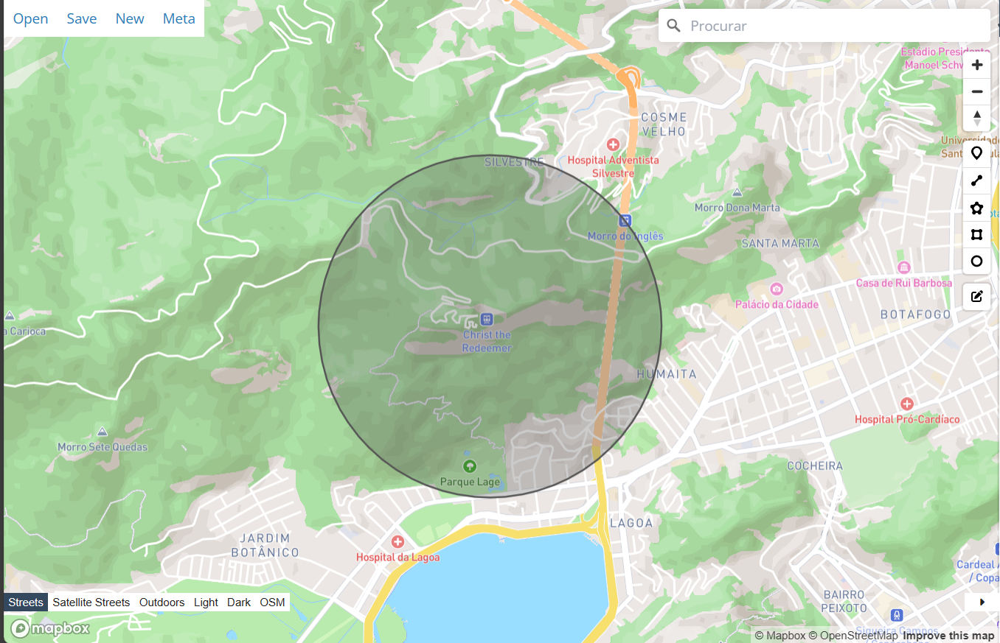
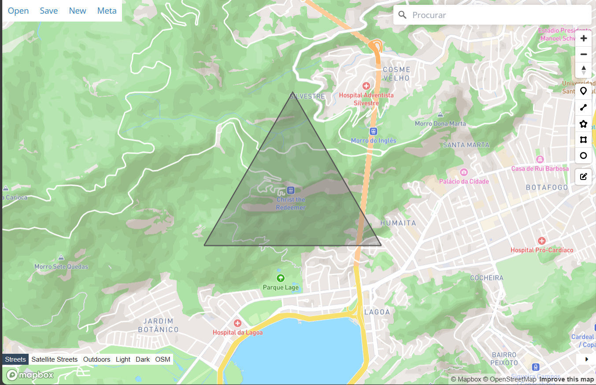
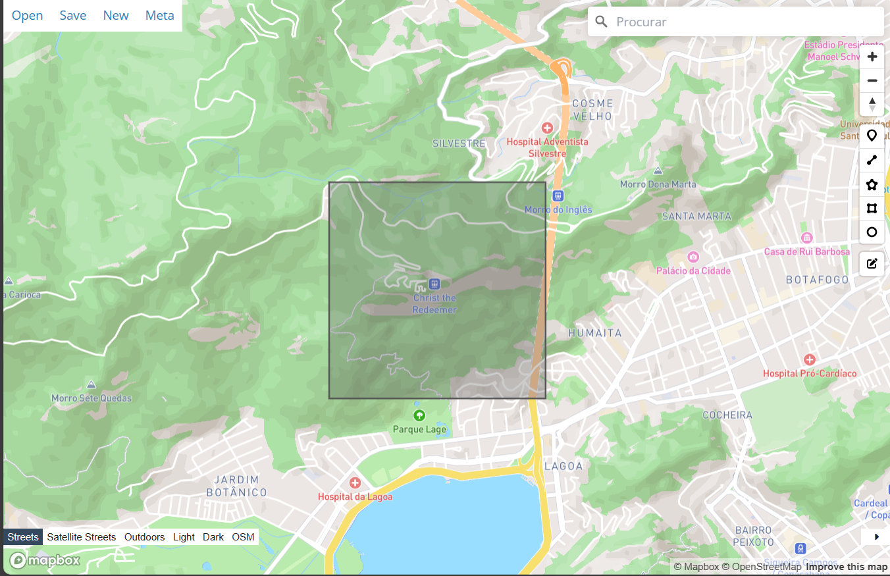
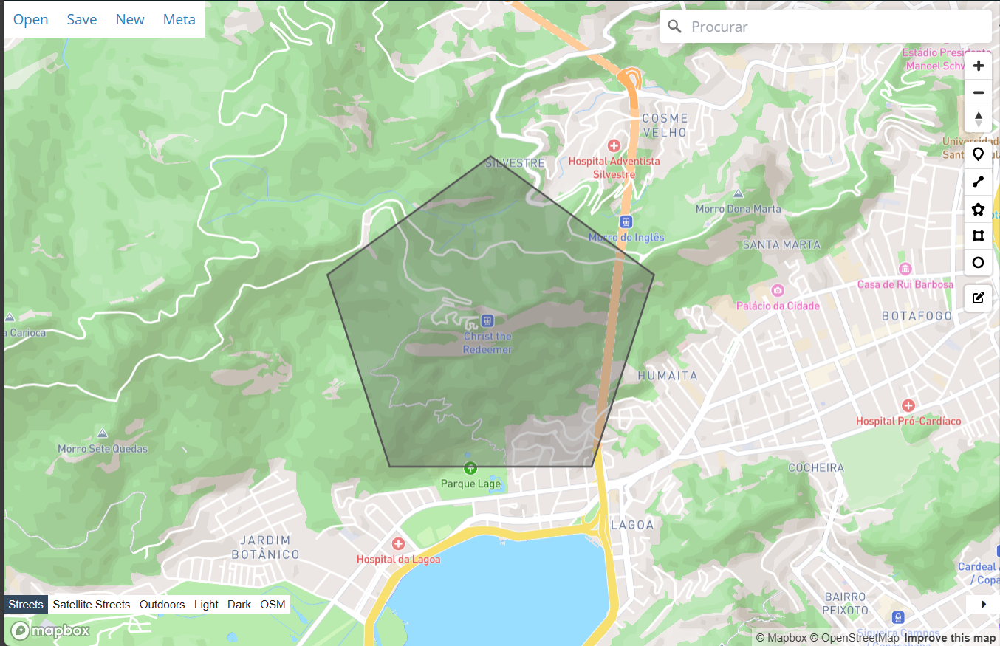
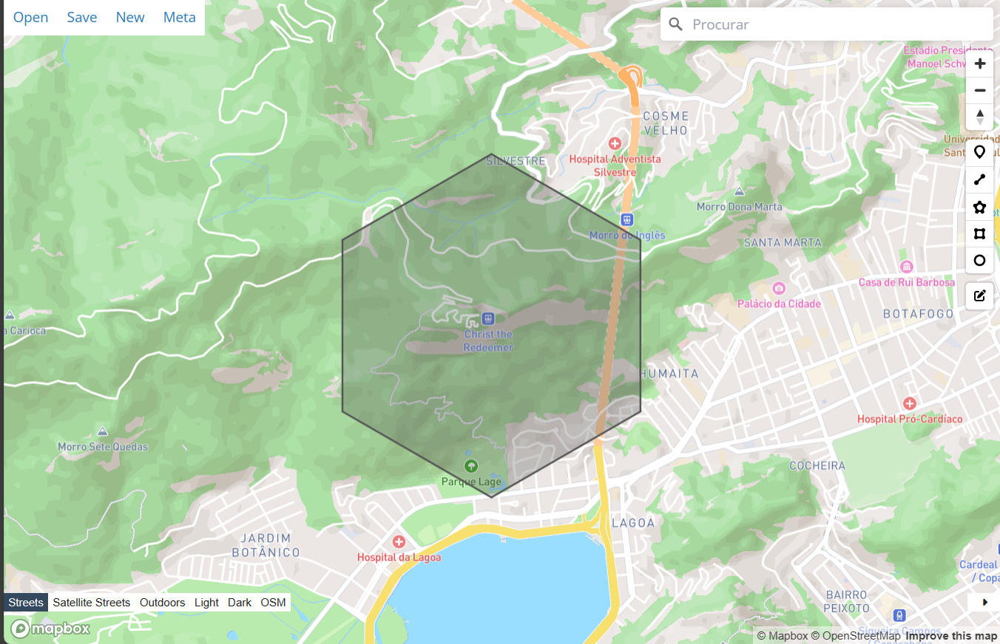

## Build

Run the commands to install the dependencies and build the project

```sh
npm install
npm run compile
```

## Examples

The file `examples.js` generates one file to each type of polygon area supported by the project

```sh
node ./build/examples.js
```

The GeoJSON files can be found at the `output` folder

To see the files in a map at the browser, run the command:

```sh
docker compose up geojson-viewer
```

A list of links will be shown at the terminal. Each link opens a page with the polygon over the map

```sh
| Access the files at the address:
| --> http://localhost:8099/#data=data:text/x-url,/geojson-data/geojson-circular.geojson.json
| --> http://localhost:8099/#data=data:text/x-url,/geojson-data/geojson-hexagonal.geojson.json
| --> http://localhost:8099/#data=data:text/x-url,/geojson-data/geojson-pentagonal.geojson.json
| --> http://localhost:8099/#data=data:text/x-url,/geojson-data/geojson-square.geojson.json
| --> http://localhost:8099/#data=data:text/x-url,/geojson-data/geojson-triangular.geojson.json
|
| Live server started
```

## Documentation

### Circular area

```ts
const CA = new CircularArea(
  {latitude: -22.952125, longitude: -43.210516},
  1000
);

const geoJSON = CA.getGeoJSON();
```



### Triangular area

```ts
const TA = new TriangularArea(
  {latitude: -22.952125, longitude: -43.210516},
  1000
);

const geoJSON = TA.getGeoJSON();
```



### Square area

```ts
const SA = new SquareArea(
  {latitude: -22.952125, longitude: -43.210516},
  1000
);

const geoJSON = SA.getGeoJSON();
```



### Pentagonal area

```ts
const PA = new PentagonalArea(
  {latitude: -22.952125, longitude: -43.210516},
  1000
);

const geoJSON = PA.getGeoJSON();
```



### Hexagonal area

```ts
const HA = new HexagonalArea(
  {latitude: -22.952125, longitude: -43.210516},
  1000
);

const geoJSON = HA.getGeoJSON();
```


